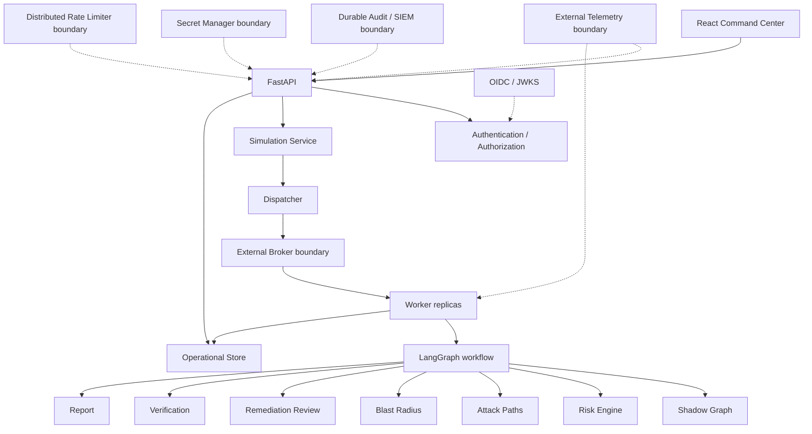

# Autonomous Red Teaming & Attack Graph Simulator

> **Defensive, human-gated Breach-and-Attack-Simulation (BAS) / Continuous Threat
> Exposure Management (CTEM) platform.** It maps controlled cloud/Kubernetes-like assets
> into a graph, bounds attack paths *before* AI planning, simulates MITRE ATT&CK-aligned
> decisions, and proposes remediation that a human must approve — **nothing touches real
> infrastructure.**

<p>
  <a href="https://github.com/Santidelacarrera/autonomous-red-teaming/actions/workflows/ci.yml"></a>
  <a href="https://github.com/Santidelacarrera/autonomous-red-teaming/actions/workflows/codeql.yml"></a>
  <a href="https://github.com/Santidelacarrera/autonomous-red-teaming/actions/workflows/scorecard.yml"></a>
</p>
<p>
  
  
  
  
  
  
  
  
  
  
</p>

**Audience:** security engineers, platform/SRE teams, architects, reviewers, and operators.

**This project is *not*** an exploitation framework, a cloud control plane, a deployment
engine, or an autonomous offensive tool. Production adapter *contracts* are present; vendor
services are never represented as connected when they are not.

---

### ⚡ TL;DR — run the full pipeline in ~60 seconds

```powershell
py -3.12 -m venv .venv
.\.venv\Scripts\python.exe -m pip install -r requirements.lock
.\.venv\Scripts\python.exe -m pip install -e . --no-deps
Copy-Item .env.example .env            # dev profile: header auth, SQLite, in-process worker
.\.venv\Scripts\python.exe -m uvicorn art_sim.api.main:app --reload --port 8080
```

```bash
# Smoke-test the human-gated lifecycle (dev bearer = "development:<role>:<subject>")
curl -s localhost:8080/health
curl -s -H "Authorization: Bearer development:operator:you" \
     -H "Content-Type: application/json" -H "Idempotency-Key: demo-1" \
     -d '{"scenario_id":"shadow-demo"}' localhost:8080/api/v1/simulations
```

The run advances `CREATED → RUNNING → WAITING_APPROVAL`, waits for a human decision, then
`RESUMING → SUCCEEDED` with an immutable, verified evidence set. See [§6](#6-simulation-lifecycle).

### ✅ Verified operational (last local audit)

The end-to-end pipeline was executed against a live Neo4j AuraDB Shadow instance:

| Stage | Result |
| --- | --- |
| `scripts/seed_db.py` | Shadow topology seeded (EKS → IAM role → crown-jewel DB) |
| `scripts/run_e2e.py` | Recon → MITRE planning → simulation → remediation artifact generated |
| API lifecycle | create → `waiting_approval` → human approve → `verified` → `succeeded` |
| Risk reduction | **51.0 → 0.0** (the generated IAM `Deny` policy neutralizes the simulated path) |
| Auth boundary | unauthenticated request correctly rejected (`401`) |

> ⚠️ **Production status is intentionally `NOT READY — pending external infrastructure only`**
> — see [§20](#20-production-readiness). The application boundaries are complete, tested, and
> container-hardened (image scan passes the `high` gate with 0 fixable High/Critical). The only
> remaining gap is that external dependencies (broker, server database, secret manager, OIDC
> tenant, SIEM, telemetry, TLS edge) are deployment-owned and not connected here — by design,
> an honest disclosure rather than a defect.

## 1. Project Overview

This repository implements a defensive BAS/CTEM simulation platform. It maps controlled
AWS/Kubernetes-like assets into a graph, bounds candidate paths before AI planning,
simulates MITRE ATT&CK-aligned decisions, requires human approval for remediation
proposals, verifies those proposals against an isolated model, and exposes evidence
through an API and React command center.

The design philosophy is **fail-closed, boundary-first, and honest about what is not
connected**: every external capability (identity, secrets, broker, database, audit,
telemetry, rate limiting) is a typed port with a production capability check, and the
composition root refuses to start production with a development-grade adapter.

## 2. Security Boundary

> This platform performs defensive, controlled security simulations. It does not execute attacks against real infrastructure.

All topology and execution operate on a Shadow Graph and allow-listed scenarios. Attack
paths, vulnerabilities, IAM relationships, credentials, remediation, and post-change
verification are simulated. Verification uses immutable/versioned artifacts and does not
invoke `terraform apply`, `tofu apply`, `kubectl apply`, cloud APIs, shells, payloads,
malware, persistence, credential theft, or data exfiltration.

## 3. Architecture



Development composes SQLite and an in-process queue. Production composition rejects
those adapters and requires externally supplied server-grade implementations.

## 4. Repository Structure

```text
src/art_sim/
  agents/           LangGraph recon, planner, supervisor and simulator nodes
  api/              FastAPI routes, services and composition roots
  attack/           Shadow graph and deterministic risk calculation
  blast_radius/     Simulated impact calculation
  domain/           Validated models, ports and domain exceptions
  infrastructure/   Neo4j/Cypher and review-only GitHub adapter
  observability/    Typed metrics, traces and logging boundaries
  platform/         Lifecycle, persistence ports, health and configuration
  remediation/      HITL, proposal generation, export and verification
  reporting/        Markdown evidence reports
  security/         OIDC, RBAC, MFA, audit, secrets, rate limit and sanitization
  worker/           Jobs, dispatch, leases, workflow and broker contracts
frontend/           React/Vite command center
scripts/            Shadow seed/E2E and artifact-manifest utilities
tests/              Unit, integration and security suites
docs/               Architecture, operations, security and recovery documentation
```

## 5. Core Components

- **API / SimulationService:** validates allow-listed single or bounded batch requests,
  persists every run before dispatch, and enforces idempotency, pagination, lifecycle and
  backend permissions. Local mixed batches rotate through five controlled Shadow routes.
- **Dispatcher / Broker:** local development queue or a provider-neutral distributed
  boundary for Redis Streams, RabbitMQ, Kafka, or SQS adapters supplied by deployment.
- **Worker / LangGraph:** claims one run with a lease and fencing token, executes only a
  controlled workflow, checkpoints HITL state, and publishes one immutable result.
- **Shadow Graph:** isolated, in-memory simulation model; Neo4j is used for parameterized
  topology reads and deterministic shortest-path reduction, not real exploitation.
- **Risk, attack path and blast radius engines:** deterministic bounded analysis before
  data reaches agent planning.
- **Remediation / verification / reporting:** generates review-only IaC/policy candidates,
  verifies their simulated effect, applies deterministic automated pre-approval checks,
  and renders correlated evidence. Pre-approval never replaces HITL authorization.
- **Operational Store:** SQLite implementation for development; server-grade transaction,
  CAS, lease, fencing, checkpoint and artifact contract for production.
- **Audit / telemetry / identity / secrets:** typed provider-neutral boundaries with
  fail-closed production capability checks and no implicit vendor connection.

## 6. Simulation Lifecycle

```text
CREATED -> RUNNING -> WAITING_APPROVAL -> RESUMING -> SUCCEEDED
              |              |               |
              +--------------+---------------+--> FAILED / CANCELLED / REJECTED
```

`CREATED` is durably accepted; `RUNNING` has a fenced owner; `WAITING_APPROVAL` has a
checkpoint plus an immutable review package but no applied change; `RESUMING` continues
after one CAS-protected decision;
`SUCCEEDED` has one immutable artifact set. `FAILED`, `CANCELLED`, `REJECTED`, and the
legacy `COMPLETED` value are terminal. Exhausted retries terminate as `FAILED` with
`MAX_ATTEMPTS_EXCEEDED`; it is an error code, not a separate persisted status.

See [state machine](docs/state-machine.md).

## 7. Distributed Execution

`SimulationJobV1` is strict, versioned, size-bounded, deterministic by logical attempt,
and contains no credentials. The distributed contract covers publish, receive,
acknowledge, negative acknowledgement, delayed retry, visibility extension, delivery
attempt, correlation, health, backpressure (`max_in_flight`) and graceful close.

The operational store, not the broker alone, supplies correctness: one live owner,
expiring lease, heartbeat, monotonic fencing token, stale-worker rejection, bounded
retry/backoff/jitter, poison-job evidence, DLQ boundary, duplicate-delivery idempotency,
and cooperative durable cancellation. See [distributed execution](docs/distributed-execution.md)
and [dispatcher contract](docs/dispatcher.md).

## 8. Security Architecture

Production requires OIDC with HTTPS JWKS, asymmetric algorithm allow-list, exact issuer
and audience, required `exp`/`nbf`/`iat`/`sub`, rotating key cache, locally derived RBAC,
and an explicit trusted MFA claim for approval. Sensitive approval decisions use HMAC
evidence, lifecycle checks, CAS and replay protection. Rate limiting is per network key,
subject and sensitive endpoint; production rejects process-local limiting.

Secrets are referenced by name, resolved asynchronously at startup, length-validated,
redacted, and excluded from API responses, jobs, audit and telemetry. HTTP controls
include request-size limits, restrictive CORS, generic error envelopes, security headers
(`Content-Security-Policy`, `X-Content-Type-Options`, `Referrer-Policy`, `X-Frame-Options`,
`Permissions-Policy`), request correlation and production HSTS. The React command center
ships a strict CSP injected into the production build (`default-src 'none'`, no inline
scripts), while the dev server keeps HMR. Static analysis (`bandit`) runs on first-party
Python in CI. See [security architecture](docs/security-architecture.md).

## 9. Persistence

### Development

`SqliteOperationalStore` uses WAL and transactional CAS for a single-node development
runtime. It is explicitly `SINGLE_NODE` and is rejected by production composition.

### Production

`ServerOperationalStore` and `ServerDatabaseSettings` define a PostgreSQL/equivalent
boundary for transactions, row locking/CAS, concurrent leases, fencing, durable state,
immutable artifacts, correlated audit, checkpoints and recovery. No PostgreSQL adapter or
database connection is included; this capability is `READY WITH EXTERNAL DEPENDENCY`.

## 10. API

`/health` and `/readiness` are public. Other routes require bearer authentication; object
data is limited to the controlled scenario catalog and persisted run identifiers.

| Method | Path | Purpose | Required permission / lifecycle |
| --- | --- | --- | --- |
| GET | `/health` | Process liveness only | Public |
| GET | `/readiness` | Required dependency readiness | Public; 503 when unavailable |
| GET | `/api/v1/identity` | Verified caller context | `simulation:read` |
| POST | `/api/v1/logout` | End local session context | `simulation:read` |
| GET | `/api/v1/scenarios` | Allow-listed Shadow scenarios | `simulation:read` |
| POST | `/api/v1/simulations` | Create/idempotently dispatch | `simulation:create`; configured scenario |
| POST | `/api/v1/simulations/batch` | Create 1–10 isolated runs across selected scenarios | `simulation:create`; configured scenarios; idempotency key |
| GET | `/api/v1/simulations` | Paginated run list | `simulation:read` |
| GET | `/api/v1/simulations/{run_id}` | Run lifecycle | `simulation:read` |
| POST | `/api/v1/simulations/{run_id}/approval` | Approve/reject checkpoint | approve/reject permission; waiting state; MFA when configured |
| POST | `/api/v1/simulations/{run_id}/cancel` | Cooperative cancellation | `simulation:cancel`; non-terminal run |
| GET | `/api/v1/simulations/{run_id}/risk` | Risk evidence | `risk:read`; result available |
| GET | `/api/v1/simulations/{run_id}/attack-paths` | Simulated paths | `attack_path:read`; result available |
| GET | `/api/v1/simulations/{run_id}/blast-radius` | Simulated impact | `blast_radius:read`; result available |
| GET | `/api/v1/simulations/{run_id}/remediations` | Review-only candidates | `remediation:read`; result available |
| GET | `/api/v1/simulations/{run_id}/review` | Countermeasure, digest and simulated before/after evidence | `remediation:read`; persisted review available |
| GET | `/api/v1/simulations/{run_id}/verification` | Simulated verification | `verification:read`; result available |
| GET | `/api/v1/simulations/{run_id}/report` | Markdown report | `report:read`; result available |
| GET | `/api/v1/simulations/{run_id}/events` | Safe timeline | `audit:read` |
| GET | `/api/v1/security/status` | Security state/audit summary | `security:admin` |

## 11. Frontend

The React/Vite command center authenticates through an injected OIDC client boundary,
protects routes, hides actions that the role cannot perform, polls only active runs with
bounded backoff, supports cancellation, and stops polling terminal states. HITL approval
requires an immutable review package, a passing automated recommendation and a reviewer
rationale. Batch creation supports 1–10 runs while decisions remain individual. It talks
only to the API and cannot invoke infrastructure tooling. Development bearer identity is
available only in development builds. See [frontend](docs/frontend.md).

## 12. Configuration

Copy `.env.example` for local development. `.env.production.example` contains only
non-secret provider references/placeholders; actual credentials belong in an external
secret manager. The authoritative loaders are `SecuritySettings.from_environment()` and
`ProductionDependencySettings.from_environment()`.

Key groups are:

- `ART_ENV`, `ART_SIM_OPERATIONAL_DB`, `ART_AUTH_MODE`;
- `ART_OIDC_*`, `ART_CORS_ALLOWED_ORIGINS`, `ART_*_REQUESTS_PER_MINUTE`;
- `ART_BROKER_*`, `ART_DATABASE_*`, `ART_SECRET_PROVIDER`;
- `ART_AUDIT_*`, `ART_TELEMETRY_PROVIDER`, `ART_RATE_LIMIT_PROVIDER`;
- `ART_*_RETENTION_DAYS`, `ART_TLS_TERMINATED_UPSTREAM`,
  `ART_TRUSTED_PROXY_HOPS`, `ART_MAX_REQUEST_BYTES`;
- local Shadow E2E only: `NEO4J_URI`, `NEO4J_USER`, `NEO4J_PASSWORD`;
- frontend: `VITE_API_BASE_URL`, `VITE_BACKEND_URL`, `VITE_AUTH_MODE`,
  `VITE_POLL_INTERVAL_MS`.

See [configuration](docs/configuration.md) for validation and trust boundaries.

## 13. Local Development

```powershell
py -3.12 -m venv .venv
.\.venv\Scripts\python.exe -m pip install -r requirements.lock
.\.venv\Scripts\python.exe -m pip install -e . --no-deps
Copy-Item .env.example .env
.\.venv\Scripts\python.exe -m uvicorn art_sim.api.main:app --reload --port 8080
```

Or run the whole hardened stack in one command with Docker (add `--profile shadow` to also
start a local Neo4j for the seed/E2E scripts):

```bash
docker compose up --build          # API on http://127.0.0.1:8080
```

A [`Makefile`](Makefile) wraps the common tasks (`make check` runs lint + typecheck +
security + tests; `make docker-scan` builds and scans the image). On Windows, run it under
Git Bash/WSL or use the PowerShell commands shown here.

In another terminal:

```powershell
Set-Location frontend
npm ci
npm run dev
```

Validation and the optional Neo4j-backed Shadow E2E:

```powershell
.\.venv\Scripts\python.exe -m pytest
.\.venv\Scripts\python.exe -m ruff check .
.\.venv\Scripts\python.exe -m mypy .
.\.venv\Scripts\python.exe scripts/seed_db.py
.\.venv\Scripts\python.exe scripts/run_e2e.py
```

The seed/E2E scripts require an explicitly configured local Shadow Neo4j instance and do
not mutate cloud or Kubernetes infrastructure.

## 14. Production Deployment

```text
Internet
  -> TLS / API Gateway / WAF
  -> FastAPI replicas
  -> Distributed Broker
  -> Worker replicas
  -> PostgreSQL/equivalent
  -> Secret Manager + OIDC + Distributed Rate Limiter + SIEM + OpenTelemetry
```

Every component after the application image is an external dependency. The repository
does not deploy it. Production requires migrations before traffic, readiness gating,
graceful drain, backup/restore verification, rollback to a compatible image/schema, and
separate worker/API scaling. See [deployment](docs/deployment.md).

## 15. Observability

Typed events expose safe structured logs, metrics and traces correlated by `request_id`,
`run_id`, `trace_id`, and `worker_id`; a fencing token is included only in operational
ownership evidence. The metric vocabulary includes started/succeeded/failed/cancelled/
recovered simulations, duration, lease expiry, fencing rejection, approval latency,
result persistence, broker/database failures, poison jobs, retries and active workers.
Production requires an external telemetry adapter; no OpenTelemetry or Prometheus backend
is claimed as connected.

## 16. Reliability

External calls use bounded retry with exponential backoff and jitter. Durable ownership
uses leases, heartbeats and fencing. Native LangGraph checkpoints support restart at HITL
boundaries. Cancellation is durable and CAS-controlled. Result artifacts are immutable
and publication rolls back on workflow/version conflict. API and worker shutdown drain
accepted work and close injected dependencies.

## 17. Testing

The local audit executes unit, integration, security, concurrency, recovery,
frontend and controlled Shadow E2E suites. The current verified count is **125 backend
tests** and **20 frontend tests**; Ruff, strict Mypy (100 Python files), `bandit` (0
findings), frontend lint/typecheck/build, `pip-audit`, and `npm audit` pass. The pinned Docker image builds,
runs under the hardened invocation, passes local health/readiness and shuts down cleanly.
The Grype image scan now **passes** the configured `high` gate: the runtime stage applies
`apt-get upgrade`, closing every OS CVE with an available fix (**0 fixable High/Critical**),
and the scan policy ([.grype.yaml](.grype.yaml)) fails only on *fixable* findings with a
single documented disposition for a CPython CVE whose only fix is a pre-release. See
[test matrix](docs/test-matrix.md).

## 18. Security Testing

Targeted tests cover OIDC/JWT/JWKS rotation, issuer/audience/time/algorithm checks, RBAC,
MFA, approval HMAC and replay/CAS behavior, secret redaction, process-vs-distributed
capabilities, lease expiry, fencing, stale workers, duplicate delivery, poison jobs,
cancellation races, result publication races, checkpoint corruption and restart recovery.

## 19. Threat Model

The [threat model](docs/threat-model.md) records assets, attackers, preconditions, attack
surfaces, controls, detection, residual risk and mitigation for worker compromise, replay,
races, credential leakage, malicious scenarios, API abuse, tampering and denial of service.

## 20. Production Readiness

See the objective [production-readiness matrix](docs/production-readiness.md). Application
boundaries are implemented, but mandatory broker, server database, Secret Manager, OIDC
tenant, distributed rate limiter, SIEM, telemetry backend and TLS edge are not connected.
Current overall status: **NOT READY — pending external infrastructure only.** The
application itself is complete, tested, and container-hardened: the image scan now passes
the `high` gate (0 fixable High/Critical after the runtime `apt-get upgrade`). The sole
remaining gap is that production vendor services are deployment-owned and not connected in
this repository — by design.

### Validated locally

Application tests/static analysis, frontend build, dependency audits, Shadow E2E, source
SBOMs/hashes, immutable base/action references, Docker build, image inspection, hardened
runtime, container health/readiness/SIGTERM and Syft image SBOM generation.

### Validated with external infrastructure

None. No production vendor service or hosted attestation result was available to this
audit.

### Ready with external dependency

OIDC validation, production composition, distributed-worker/store/broker/secret/limiter/
audit/telemetry boundaries, TLS edge contract, Anchore gates and GitHub provenance config.

### Not yet validated

Concrete production adapters, migrations, deployment, hosted provenance verification,
backup/restore and multi-region recovery. The image scan was executed but failed; its High
findings require remediation or formal review rather than being treated as unvalidated.

## 21. Operational Runbooks

- [Startup, shutdown and outage response](docs/operations.md)
- [Worker recovery](docs/worker-recovery.md)
- [Broker/dispatcher semantics](docs/dispatcher.md)
- [Disaster recovery](docs/disaster-recovery.md)
- [Security operations and secret rotation](docs/security-operations.md)
- [Deployment and rollback](docs/deployment.md)

## 22. Supply Chain Security

Python ships a **hash-complete** runtime lockfile installed with `--require-hashes` (the
image fails to build if any dependency is tampered with or a hash is missing), an exact
development lockfile, and npm uses `package-lock.json`. [Dependabot](.github/dependabot.yml)
keeps pip, npm, GitHub Actions and the base image patched weekly, [CodeQL](.github/workflows/codeql.yml)
runs `security-extended` analysis on Python and TypeScript, and a [pre-commit](.pre-commit-config.yaml)
config runs Ruff, Bandit, Gitleaks and private-key detection before code leaves a machine. CI runs
Ruff, Mypy, Pytest, Bandit, frontend checks, `pip-audit`, `npm audit`, Gitleaks, wheel build,
CycloneDX SBOM generation, SHA-256 evidence, container build and Anchore image scan.
The release audit generated and validated local CycloneDX Python/frontend/image SBOMs plus
a SHA-256 manifest under ignored `var/audit/`. Grype 0.119.0 and Syft 1.52.0 are versioned
explicitly in CI; the local Grype result fails the `high` cutoff.
All Actions use immutable commit SHAs. GitHub artifact provenance is configured for
`push`, but remains unvalidated until a hosted workflow emits and independently verifies
an attestation.

## 23. Docker

```powershell
docker build -t art-sim:local .
docker run --rm --read-only `
  --tmpfs /tmp:rw,noexec,nosuid,nodev,size=64m `
  --tmpfs /app/var:rw,noexec,nosuid,nodev,size=64m,uid=10001,gid=10001 `
  --cap-drop ALL --security-opt no-new-privileges:true `
  --pids-limit 128 --memory 512m --cpus 1 `
  -p 127.0.0.1:8080:8080 art-sim:local
```

The multi-stage image installs the runtime lock only, runs as UID/GID 10001, excludes
`.env`, defines `/health`, and uses `SIGTERM`. Python 3.13.15/Trixie is pinned by immutable
manifest-list digest. The validated invocation used a read-only root filesystem, tmpfs at
`/tmp` and `/app/var`, zero capabilities, `no-new-privileges`, seccomp and bounded PID/CPU/
memory. Health and readiness returned 200 and SIGTERM exited 0. The runtime stage runs
`apt-get upgrade` so the image ships with every fixable OS CVE closed, and the Grype gate
([.grype.yaml](.grype.yaml)) passes the `high` threshold.

## 24. CI/CD

`.github/workflows/ci.yml` defines frontend lint/typecheck/test/build/audit, backend
Ruff/Mypy/Pytest/audit/wheel, Gitleaks, SBOMs, artifact hashing, container build, image
scanning and GitHub artifact attestation. A separate [`codeql.yml`](.github/workflows/codeql.yml)
workflow runs `security-extended` static analysis on pushes, PRs and a weekly schedule, and
[Dependabot](.github/dependabot.yml) opens grouped weekly dependency PRs. Third-party Actions
are commit-pinned. A workflow definition is not proof of a successful hosted run; verify the
workflow and attestation before promoting an artifact.

## 25. Failure Modes

| Failure | Expected behavior |
| --- | --- |
| Broker not configured | Startup composition rejection / `BROKER_NOT_CONFIGURED` |
| Broker unavailable | Bounded retry, readiness 503, safe `BROKER_UNAVAILABLE` |
| Broker operation rejected | Safe `BROKER_OPERATION_FAILED`; no internal detail |
| Database unavailable | Readiness failure; no success publication |
| Secret unavailable | Startup/readiness fail closed |
| Worker crash | Lease expiry and fenced recovery |
| Stale worker | Fencing rejection |
| Duplicate message | Idempotent claim/no duplicate result |
| Poison job | Safe DLQ record and terminal failure |
| Approval replay/race | CAS rejection; one decision |
| Cancel race | Deterministic terminal CAS; no result after cancellation wins |
| Corrupt checkpoint | Explicit safe recovery failure |
| Telemetry/audit unavailable | Readiness failure in production; no secret fallback payload |

## 26. Security Guarantees

The code path has no arbitrary command execution, real exploit execution, remediation
apply, cloud/Kubernetes mutation, credential exfiltration, or offensive persistence.
Backend authorization is authoritative. Production secrets fail closed. Fencing rejects
stale ownership, successful results are immutable, and audit schemas reject credential-
shaped metadata. These guarantees do not replace deployment hardening or external-service
security.

## 27. Known Limitations

- No concrete Redis/RabbitMQ/Kafka/SQS transport is connected.
- No PostgreSQL/equivalent operational-store adapter is implemented.
- No AWS/Vault/GCP/Azure secret-manager adapter is connected.
- No SIEM, OpenTelemetry/Prometheus, distributed limiter, or real OIDC tenant is connected.
- TLS/API gateway/WAF, backups, retention jobs, multi-region coordination and deployment
  are external.
- The runtime lock (`requirements-runtime.lock`, shipped in the image) is hash-complete and
  installed with `--require-hashes`; the dev/CI lock (`requirements.lock`) is exact-pinned
  but intentionally not hash-complete so ad-hoc CI tooling can be added on the same command.
- The Grype image scan passes the `high` gate: the runtime stage applies `apt-get upgrade`
  (0 fixable High/Critical) and [.grype.yaml](.grype.yaml) fails only on fixable findings.
  Remaining matches are Medium/Low or OS CVEs with no upstream fix, tracked by severity.
- GitHub artifact provenance is configured but has no hosted execution/verification
  evidence; container provenance is not configured.

## 28. Roadmap

### Implemented

Simulation-only graph/agent workflow, HITL, API/UI, local durable worker, broker/database/
secret/audit/telemetry/rate-limit contracts, production capability checks, readiness,
failure/concurrency/recovery tests, lockfiles and CI supply-chain gates.

### External Integration

Implement and certify deployment-owned adapters, migrations, OIDC tenant, TLS edge,
retention jobs, alerting, backups, restore drills and hosted CI evidence.

### Future

Multi-region ownership semantics, organization-specific compliance retention, container
provenance, independent attestation verification and measured capacity/load targets.
Future work must preserve simulation-only scope.

## 29. License

Released under the [MIT License](LICENSE) © 2026 Santiago de la Carrera. The license file
also carries a non-binding defensive-use notice: this is a simulation-only platform meant
for authorized security testing, education, and CTEM/blue-team workflows.
