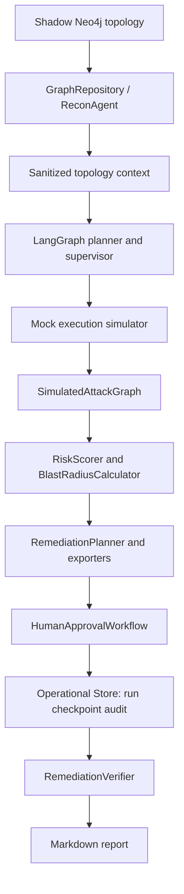

# Architecture



## Components and public contracts

| Component | Responsibility / inputs / outputs | Dependencies and effects |
| --- | --- | --- |
| `domain` | Typed `Asset`, `Identity`, `Vulnerability`, `AttackPath` and repository contract. | Pydantic only; no infrastructure I/O. Invalid shapes raise domain/value validation errors. |
| `Neo4jGraphRepository` | Upserts Shadow topology; fetches assets; returns deterministic bounded shortest paths. | Async Neo4j driver, parameterized Cypher and retries. This is the graph persistence adapter. |
| `ReconAgent` + sanitizer | Reads one bounded path and projects it to allow-listed asset IDs/types/relations. | Depends on `GraphRepository`; excludes names, tags and relation properties from planner context. |
| `AttackSimulationGraph` | Orchestrates recon, planner, scope supervisor and mock simulator. | LangGraph in-process state; simulator has no external side effect. Scope failures replan or stop. |
| `SimulatedAttackGraph` | Bounded BFS and copy-on-write relation what-if analysis. | In-memory only; has no repository or driver dependency. |
| Risk / blast radius | Calculate deterministic score and reachability metrics. | Pure typed inputs; no persistence or network I/O. |
| Remediation | Produces normalized, review-only JSON/HCL/Rego/Gatekeeper artifacts. | No apply command is present. GitHub publishing is a separately injected adapter. |
| HITL / verification | Interrupts before decision; validates HMAC and lifecycle; verifies a graph copy. | `MemorySaver` by default, injected verifier; no real remediation is applied. |
| `platform` | Durable `SimulationRun`, portable checkpoints, append-only audit, approval compare-and-set, and health contracts. | SQLite WAL adapter runs short transactions through `asyncio.to_thread`; no secret values are persisted. |
| Reporting / telemetry | Renders Markdown and stores in-memory spans/metrics. | Optional JSON logging sink exists; no external tracing backend. |

## Dependency graph

```text
domain <- infrastructure
domain <- security <- agents
domain <- attack <- blast_radius
domain <- remediation <- reporting
agents -> observability
platform <- security
```

There are no runtime import cycles in the audited graph. `ScopeViolationError` uses a
type-only import and a lazy constructor to avoid a domain-to-agent cycle. Infrastructure
is outside the domain boundary. The largest composition point is `AttackSimulationGraph`;
it intentionally coordinates four injected collaborators and is not refactored here.

## Simulation-run contract for Phase 7

`SimulationRun`, `WorkflowCheckpoint`, and `AuditEvent` are now versioned contracts.
They correlate `run_id`, lifecycle, graph/workflow versions, before/after metrics,
approval/verification status, artifact references, and safe error codes. The SQLite
adapter implements the associated ports, and `sqlite_langgraph_checkpointer()` provides
the compatible native LangGraph SQLite saver; a server database adapter remains a future
substitution for multi-node deployments.
