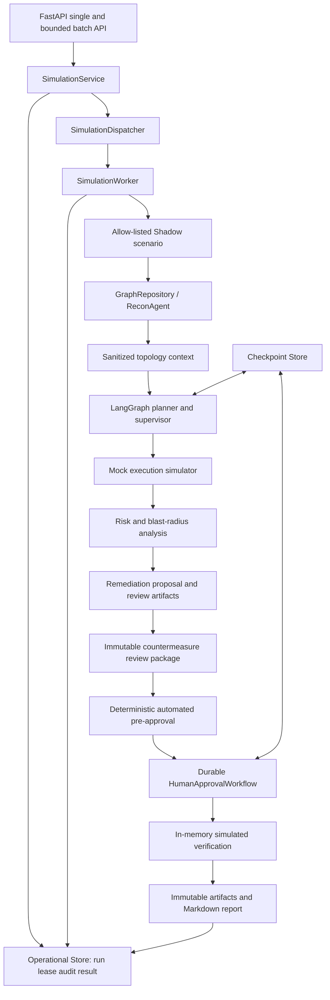

# Architecture



## Components and public contracts

| Component | Responsibility / inputs / outputs | Dependencies and effects |
| --- | --- | --- |
| `domain` | Typed `Asset`, `Identity`, `Vulnerability`, `AttackPath` and repository contract. | Pydantic only; no infrastructure I/O. Invalid shapes raise domain/value validation errors. |
| `Neo4jGraphRepository` | Upserts Shadow topology; fetches assets; returns deterministic bounded shortest paths. | Async Neo4j driver, parameterized Cypher and retries. This is the graph persistence adapter. |
| `ReconAgent` + sanitizer | Reads one bounded path and projects it to allow-listed asset IDs/types/relations. | Depends on `GraphRepository`; excludes names, tags and relation properties from planner context. |
| `AttackSimulationGraph` | Orchestrates recon, planner, scope supervisor and mock simulator. | LangGraph in-process state; simulator has no external side effect. Scope failures replan or stop. |
| `SimulatedAttackGraph` | Bounded BFS and copy-on-write relation what-if analysis. | In-memory only; has no repository or driver dependency. |
| Risk / blast radius | Calculate deterministic score and reachability metrics. | Pure typed inputs; no persistence or network I/O. |
| Remediation | Produces normalized, review-only JSON/HCL/Rego/Gatekeeper artifacts. | No apply command is present. GitHub publishing is a separately injected adapter. |
| HITL / verification | Persists the candidate, SHA-256 and simulated before/after evidence before decision; requires reviewer rationale; validates HMAC and lifecycle. | `MemorySaver` by default, injected verifier; no real remediation is applied. |
| `platform` | Durable `SimulationRun`, portable checkpoints, append-only audit, approval compare-and-set, and health contracts. | SQLite WAL adapter runs short transactions through `asyncio.to_thread`; no secret values are persisted. |
| `worker` | Claims durable work, resumes LangGraph checkpoints, executes deterministic Shadow analysis, and atomically commits terminal results. | Local dispatcher has process scope only; durable SQLite CAS and leases provide ownership. |
| Reporting / telemetry | Renders Markdown and emits typed metrics/traces. | Process collectors are development-only; production requires an external adapter. |

## Dependency graph

```text
domain <- infrastructure
domain <- security <- agents
domain <- attack <- blast_radius
domain <- remediation <- reporting
agents -> observability
platform <- security
platform <- worker -> agents
worker -> attack, blast_radius, remediation, reporting
```

There are no runtime import cycles in the audited graph. `ScopeViolationError` uses a
type-only import and a lazy constructor to avoid a domain-to-agent cycle. Infrastructure
is outside the domain boundary. The largest composition point is `AttackSimulationGraph`;
it intentionally coordinates four injected collaborators and is not refactored here.

## Simulation-run contract

`SimulationRun`, `WorkflowCheckpoint`, `AuditEvent`, execution claims, and immutable
`SimulationArtifacts` are versioned contracts. They correlate `run_id`, request and
trace identifiers, lifecycle, graph/workflow versions, approval/verification state,
artifact references, and safe error codes. SQLite stores operational ownership and
results while `sqlite_langgraph_checkpointer()` provides the official native LangGraph
checkpoint tables in the same development database. These responsibilities remain
separate even when they share a file.

See [worker.md](worker.md), [workflow-orchestration.md](workflow-orchestration.md), and
[result-persistence.md](result-persistence.md). A server database and distributed
dispatcher remain required substitutions for multi-node production.

## Production operations boundary

The API, application services, worker, and workflow depend only on ports. Production
composition requires declared capabilities: verified OIDC, distributed rate limiting,
durable audit, external secrets, server-grade operational storage, distributed dispatch,
and external telemetry. SQLite and the local queue declare single-node/process scope and
are rejected.

`SimulationJobV1` crosses the broker boundary. A database fencing token, not broker
delivery order, authorizes worker writes. See [distributed execution](distributed-execution.md)
and [operational store](operational-store.md).

Phase 13 adds explicit non-secret configuration for broker, server database, managed
secrets, durable audit retention, external telemetry, distributed rate limiting, TLS and
data retention. Production readiness probes database, broker, secret provider, identity,
limiter, audit and telemetry independently. These contracts do not instantiate or claim
vendor services.
